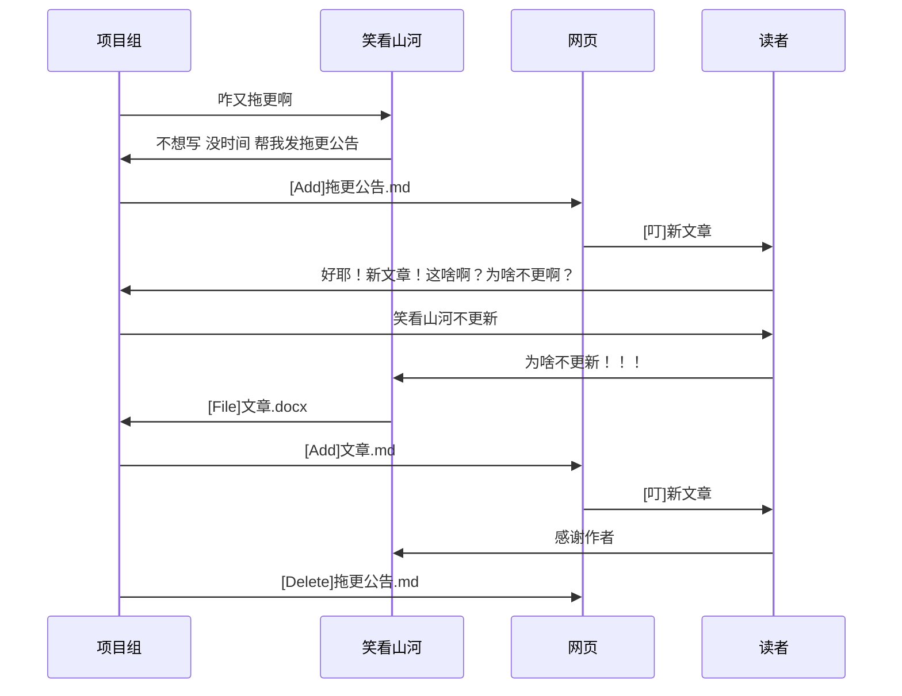
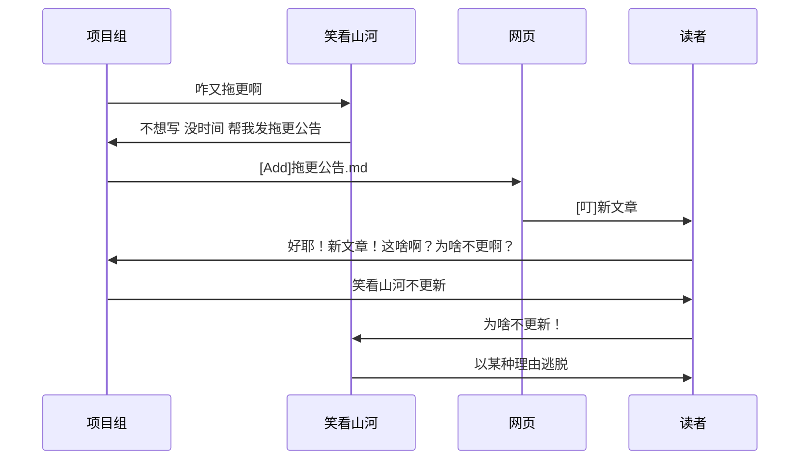

本博客为笑看山河的博客。

本博客一般一周更新一篇文章，主讲数学相关内容。

而且十分有可能不更新，但我们已经在努力的催促笑看山河更新了~

```mermaid
sequenceDiagram
项目组->> 笑看山河: 咋又拖更啊
笑看山河->> 项目组: 不想写 没时间 帮我发拖更公告
项目组->> 网页: [Add]拖更公告.md
网页->> 读者: [叮]新文章
读者->> 项目组: 好耶！新文章！这啥啊？为啥不更啊？
项目组->> 读者: 笑看山河不更新
读者->> 笑看山河: 为啥不更新！！！
笑看山河->> 项目组: [File]文章.docx
项目组->> 网页: [Add]文章.md
网页->> 读者: [叮]新文章
读者->> 笑看山河: 感谢作者
项目组->> 网页: [Delete]拖更公告.md
```

     拖更示意图(催更成功)

```mermaid
sequenceDiagram
项目组->>笑看山河: 咋又拖更啊
笑看山河->>项目组: 不想写 没时间 帮我发拖更公告
项目组->>网页: [Add]拖更公告.md
网页->>读者: [叮]新文章
读者->>项目组: 好耶！新文章！这啥啊？为啥不更啊？
项目组->>读者: 笑看山河不更新
读者->>笑看山河: 为啥不更新！
笑看山河->>读者: 以某种理由逃脱
```

     拖更示意图(催更失败)

