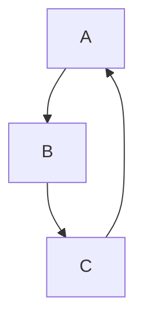
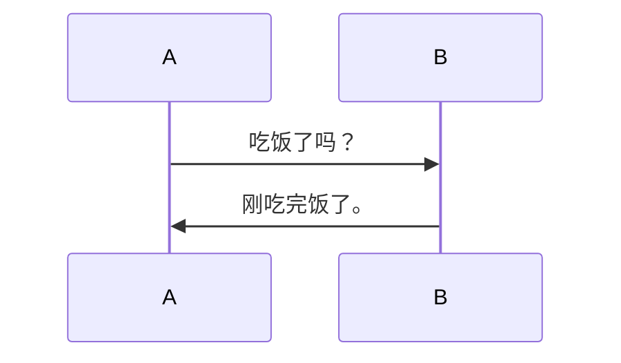
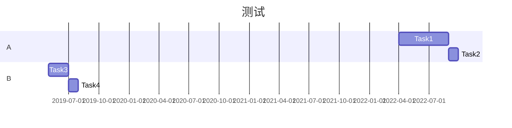

## Mermaid

````markdown

````


````markdown

````


````markdown

````


## 数学公式

`\frac{a-1}{b-1} \quad and \quad {a+1\over b+1}`
$$
\frac{a-1}{b-1} \quad and \quad {a+1\over b+1}
$$

`frac ab`    $\frac ab$

## 上下标

### 上标

`X^2^`

X^2^

### 下标

`H~2~O`

H~2~O

## 高亮

`==hello==`

==hello==