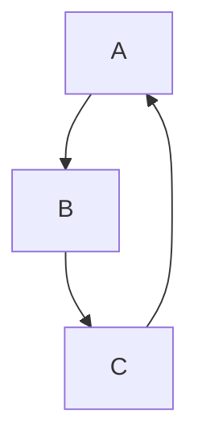
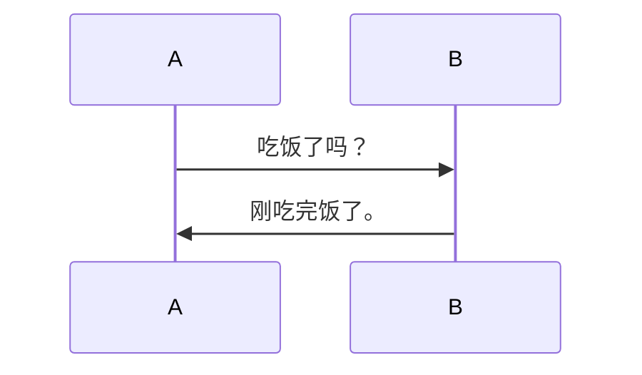
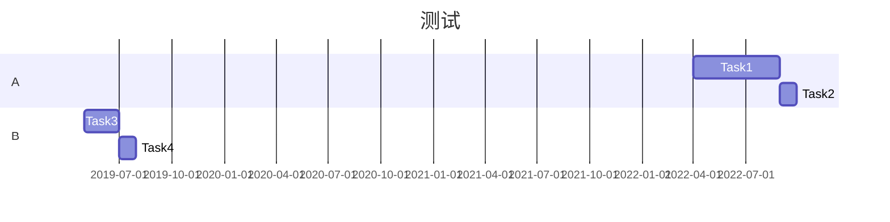

## Mermaid

```markdown


<div class="mermaid">
  graph TD;
  A-->B;
  B-->C;
  C-->A;
</div>

```markdown


<div class="mermaid">
  sequenceDiagram
  A->> B: 吃饭了吗？
  B->> A: 刚吃完饭了。
</div>

```markdown


<div class="mermaid">
  gantt
  title 测试
  dateFormat 2022-04-16
  section A
  Task1    :a1, 2022-04-01, 150d
  Task2    :after a1, 30d
  section B
  Task3    :2019-05-01, 60d
  Task4    :30d
</div>

## 数学公式

`\frac{a-1}{b-1} \quad and \quad {a+1\over b+1}`

$$
\frac{a-1}{b-1} \quad and \quad {a+1\over b+1}
$$

`frac ab`    $\frac ab$

## 上下标

### 上标

`X^2^`

X^2^

### 下标

`H~2~O`

H~2~O

## 高亮

`==hello==`

==hello==

---

[](https://creativecommons.org/publicdomain/zero/1.0/deed.zh)

本文章采用[CC0 1.0通用](https://creativecommons.org/publicdomain/zero/1.0/deed.zh)协议进行许可(不包括引用的知识共享许可证徽章)。

[联系作者](mailto:email@xilong.tk) · [侵权联系](mailto:tort@xilong.tk) —— 分享 · [QZone](https://sns.qzone.qq.com/cgi-bin/qzshare/cgi_qzshare_onekey?url=https%3A%2F%2Fblog.xilong.tk%2Ftest%2F&title=%E6%B5%8B%E8%AF%95&site=%E7%AC%91%E7%9C%8B%E5%B1%B1%E6%B2%B3%E7%9A%84%E5%8D%9A%E5%AE%A2) · [Weibo](https://service.weibo.com/share/share.php?url=https%3A%2F%2Fblog.xilong.tk%2Ftest%2F&count=1&title=%E6%B5%8B%E8%AF%95&language=zh_cn)